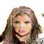
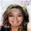
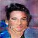
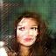
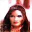
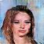
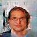
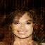
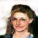
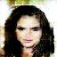

# Implement DCGAN in Tensorflow

## Abstract

本文将会讨论在学习DCGAN这一模型中可能会遇到的问题，并且在Tensorflow这一框架下部署。我们将CelebA（Ziwei Liu&Ping Luo,2016）这一经典的数据集为例，通过训练模型，最终获得一个能够在给定一串随机数列的前提下，生成一个数据集中并不存在的人脸图片，并且我们很难通过肉眼去辨别这张图片的真伪。最后得到的模型可以用于人脸识别，为训练人脸识别模型提供无数个样本，从而提高模型的准确率。

## 1 Introduction 

GAN的全称是“生成对抗网络”（Generative Adversarial Networks），最早是在2014年被提出的（Ian J. Goodfellow，2014）。但是这个模型确是最近几年才火起来。其主要原因就在于：原版的GAN模型不是很容易训练，而且训练需要耗费很长的时间。在之后的几年里，为了解决这些问题，研究者陆续提出了DCGAN（Alec Radford & Luke Metz,2016），WGAN（Martin Arjovsky,2017），LSGAN(Xudong Mao&Qing Li,2016)等等。其中DCGAN是应用比较广泛的一个，原因主要在于它在没有改变整个网络结构的前提下，仅仅通过现有的训练技巧和调试参数，就能够获得一个比较好模型，并且有着非常好的稳定性。

## 2 Model Discription

DCGAN全称是“深度卷积生成对抗网络”。顾名思义，它是一个基于CNN的模型，同时它和所有的GAN一样，有由“生成模型”和“对抗模型”组成。下面我们分别来讨论着两部分：

### 2.1 Discriminator

我先来讲讲判别模型，因为这个比较简单。但首先你必须先了解什么是CNN（卷积神经网络）。因为论文实在太久远，请自行搜索相关知识，总的来说，判别模型就是输入一张三通道的图片（64，64，3），然后对它做卷积操作。卷积核大小（5，5），每次对每一层图片提取的特征个数为128，256，512，1024（或者说是卷积核的个数，在tensorflow中被称为out_channels），卷积步长strides为（2，2），padding策略为“SAME”（这可以保证每次图片的尺寸均缩小为1/2，并省去了池化pooling的步骤）。最后将（4，4，1024）的张量reshape为16384的向量，并乘上一个（16384，1）的矩阵（这可以看作是一个全连接层），最终输出一个数字。然后使用sigmoid作为激活函数，得到的是一个[0,1]之间的数，它代表这张图是真实的概率（如果输入一张图片得到1，则说明这是一种真实的图片，如果为0则说明是假的）。损失函数使用交叉熵函数.

### 2.2 Generator

生成模型正好与判别模型相反。输入是一个100维的向量（是个随机数列），然后乘上一个矩阵，得到一个4*4*1024维的向量。然后将它reshape成一个（4，4，1024）的张量。接下来要说的，就是我所遇到的第一个坑。

### 2.3 Transpose Convelution

这里我们要实现的是卷积操作的反过程，就是把一张（4，4）的矩阵变成（8，8）的矩阵。在很多文献中都会用到“反卷积”（deconvelution）这个词来描述这个过程。但是这个词事实并不准确，而且十分误导人。《A guide to convolution arithmetic for deep learning》（Vincent Dumoulin，2018）这篇文章对这个问题讲了系统的阐述，非常值得去看一下。

用我自己的话说，我是这么认为的：我们所使用的卷积层，事实上可以抽象为一个矩阵（tensorflow就是这么干的）；例如我要将（16，16）的图片x变为（8，8）的图片y，我们只需要将图片reshape为一个16*16的向量，然后乘上一个（256，64）的矩阵A就可以了（这个矩阵具体长什么样请自行看论文）。但是这显然并不是一个可逆的矩阵，也就是说如果A'y是不可能得到x的。唯一和x有关系的是A'y的形状和x是一致的。事实上，这个矩阵和判别模型中的矩阵在数值上是没有任何关系的，他们是两个独立的矩阵，除了在形状上有那么一点像（转置后形状相同）。从更本质上来说，这依然是一个卷积操作，正如Dumouli论文中说的：

>Knowing that the equivalent convolution of the transpose of a non-padded con- volution involves full padding

它只是一种在图片周围全部填0的卷积操作，作用就是将低维的图片映射到高维。

### 2.4 Batch Normalization

这个其实并不是原创，很早以前就被提出来了（Google Inc，2015），而且已经被广泛地应用了。BN层能够确保深层网络训练的稳定，防止出现梯度消失或梯度弥散等问题。我们在生成和判别模型的除最后一层外，每一层的后面都添加一个BN层（更准确地说是每做一次矩阵乘法就使用一次BN操作）。

## 3 Implementation

直接上代码

    import tensorflow as tf
    import numpy as np
    import PIL

    #这个函数用于获取下一个batch的数据
    def get_batch(x):
        ''....''
        return noise,x_train

    # http://stackoverflow.com/a/34634291/2267819
    #说实话，下面这段BN层的代码有点没看懂，主要是测试的时候如何获得均值与方差。当然你也可以直接使用tensorflow中更加高级的API(tf.layers)，这样代码至少能剪短一半。
    def batch_norm(x, beta, gamma, phase_train, scope='bn', decay=0.9, eps=1e-5):
        with tf.variable_scope(scope):
            #beta = tf.get_variable(name='beta', shape=[n_out], initializer=tf.constant_initializer(0.0), trainable=True)
            #gamma = tf.get_variable(name='gamma', shape=[n_out], initializer=tf.random_normal_initializer(1.0, stddev), trainable=True)
            batch_mean, batch_var = tf.nn.moments(x, [0, 1, 2], name='moments')
            ema = tf.train.ExponentialMovingAverage(decay=decay)
    
            def mean_var_with_update():
                ema_apply_op = ema.apply([batch_mean, batch_var])
                with tf.control_dependencies([ema_apply_op]):
                    return tf.identity(batch_mean), tf.identity(batch_var)
            
            mean, var = tf.cond(phase_train, mean_var_with_update, lambda: (ema.average(batch_mean), ema.average(batch_var)))
            normed = tf.nn.batch_normalization(x, mean, var, beta, gamma, eps)
        return normed
    def generator(x):
        g_out0=tf.reshape(tf.matmul(x,g_W0),[batch_size,4,4,1024])
        g_out0=batch_norm(g_out0,g_beta0,g_gamma0,z)
        g_out0=tf.nn.relu(g_out0)

        g_out1=tf.nn.conv2d_transpose(g_out0,g_W1,output_shape=[batch_size,8,8,512],strides=[1,2,2,1],padding='SAME')
        g_out1=batch_norm(g_out1,g_beta1,g_gamma1,z)
        g_out1=tf.nn.relu(g_out1)

        g_out2=tf.nn.conv2d_transpose(g_out1,g_W2,output_shape=[batch_size,16,16,256],strides=[1,2,2,1],padding='SAME')
        g_out2=batch_norm(g_out2,g_beta2,g_gamma2,z)
        g_out2=tf.nn.relu(g_out2)

        g_out3=tf.nn.conv2d_transpose(g_out2,g_W3,output_shape=[batch_size,32,32,128],strides=[1,2,2,1],padding='SAME')
        g_out3=batch_norm(g_out3,g_beta3,g_gamma3,z)
        g_out3=tf.nn.relu(g_out3)

        g_out4=tf.nn.conv2d_transpose(g_out3,g_W4,output_shape=[batch_size,64,64,3],strides=[1,2,2,1],padding='SAME')
        g_out4=tf.nn.tanh(g_out4)
        return g_out4
    def discriminator(x):
        d_out0=tf.nn.conv2d(x,d_W0,strides=[1,2,2,1],padding='SAME')
        d_out0=batch_norm(d_out0,d_beta0,d_gamma0,z)
        d_out0=tf.nn.leaky_relu(d_out0)
        
        d_out1=tf.nn.conv2d(d_out0,d_W1,strides=[1,2,2,1],padding='SAME')
        d_out1=batch_norm(d_out1,d_beta1,d_gamma1,z)
        d_out1=tf.nn.leaky_relu(d_out1)
        
        d_out2=tf.nn.conv2d(d_out1,d_W2,strides=[1,2,2,1],padding='SAME')
        d_out2=batch_norm(d_out2,d_beta2,d_gamma2,z)
        d_out2=tf.nn.leaky_relu(d_out2)
        
        d_out3=tf.nn.conv2d(d_out2,d_W3,strides=[1,2,2,1],padding='SAME')
        d_out3=batch_norm(d_out3,d_beta3,d_gamma3,z)
        d_out3=tf.nn.leaky_relu(d_out3)
        
        d_out4=tf.reshape(d_out3,[batch_size,4*4*1024])
        d_out4=tf.matmul(d_out4,d_W4)
        return d_out4
    image_size=64
    n_channels=3
    n_noise=100
    n_samples=202599
    batch_size=16
    is_training=True

    tf.reset_default_graph()
    with tf.name_scope('is_training'):
        z=tf.placeholder(tf.bool)
    with tf.name_scope('Noise'):
        x=tf.placeholder(tf.float32,[batch_size,n_noise])
    with tf.name_scope('Generator'):
        g_W0=tf.Variable(tf.random_uniform([n_noise,4*4*1024]),name='g_W0')
        g_beta0=tf.Variable(tf.constant(0.0,shape=[1024]),name='g_beta0')
        g_gamma0=tf.Variable(tf.random_normal([1024],stddev=0.02),name='g_gamma0')
        g_W1=tf.Variable(tf.truncated_normal([5,5,512,1024],stddev=0.05),name='g_W1')
        g_beta1=tf.Variable(tf.constant(0.0,shape=[512]),name='g_beta1')
        g_gamma1=tf.Variable(tf.random_normal([512],stddev=0.02),name='g_gamma1')
        g_W2=tf.Variable(tf.truncated_normal([5,5,256,512],stddev=0.05),name='g_W2')
        g_beta2=tf.Variable(tf.constant(0.0,shape=[256]),name='g_beta2')
        g_gamma2=tf.Variable(tf.random_normal([256],stddev=0.02),name='g_gamma2')
        g_W3=tf.Variable(tf.truncated_normal([5,5,128,256],stddev=0.05),name='g_W3')
        g_beta3=tf.Variable(tf.constant(0.0,shape=[128]),name='g_beta3')
        g_gamma3=tf.Variable(tf.random_normal([128],stddev=0.02),name='g_gamma3')
        g_W4=tf.Variable(tf.truncated_normal([5,5,3,128],stddev=0.05),name='g_W4')
    
        g_var=[g_W0,g_beta0,g_gamma0,
            g_W1,g_beta1,g_gamma1,
            g_W2,g_beta2,g_gamma2,
            g_W3,g_beta3,g_gamma3,
            g_W4]
        
        g_pred=generator(x)
    with tf.name_scope('Images'):
        y=tf.placeholder(tf.float32,[batch_size,image_size,image_size,n_channels])
    with tf.name_scope('Discriminator'):
        d_W0=tf.Variable(tf.truncated_normal([5,5,3,128],stddev=0.005),name='d_W0')
        d_beta0=tf.Variable(tf.constant(0.0,shape=[128]),name='d_beta0')
        d_gamma0=tf.Variable(tf.random_normal([128],stddev=0.02),name='d_gamma0')
        d_W1=tf.Variable(tf.truncated_normal([5,5,128,256],stddev=0.005),name='d_W1')
        d_beta1=tf.Variable(tf.constant(0.0,shape=[256]),name='d_beta1')
        d_gamma1=tf.Variable(tf.random_normal([256],stddev=0.02),name='d_gamma1')
        d_W2=tf.Variable(tf.truncated_normal([5,5,256,512],stddev=0.005),name='d_W2')
        d_beta2=tf.Variable(tf.constant(0.0,shape=[512]),name='d_beta2')
        d_gamma2=tf.Variable(tf.random_normal([512],stddev=0.02),name='d_gamma3')
        d_W3=tf.Variable(tf.truncated_normal([5,5,512,1024],stddev=0.005),name='d_W3')
        d_beta3=tf.Variable(tf.constant(0.0,shape=[1024]),name='d_beta3')
        d_gamma3=tf.Variable(tf.random_normal([1024],stddev=0.02),name='d_gamma3')
        d_W4=tf.Variable(tf.random_uniform([4*4*1024,1]),name='d_W4')
        
        d_var=[d_W0,d_beta0,d_gamma0,
            d_W1,d_beta1,d_gamma1,
            d_W2,d_beta2,d_gamma2,
            d_W3,d_beta3,d_gamma3,
            d_W4]
        
        d_fake_pred=discriminator(g_pred)
        d_real_pred=discriminator(y)
    with tf.name_scope('Loss'):    
        d_loss_real = tf.reduce_mean(tf.nn.sigmoid_cross_entropy_with_logits(logits =d_real_pred, labels = tf.ones_like(d_real_pred)))
        d_loss_fake = tf.reduce_mean(tf.nn.sigmoid_cross_entropy_with_logits(logits = d_fake_pred, labels = tf.zeros_like(d_fake_pred)))
        g_loss = tf.reduce_mean(tf.nn.sigmoid_cross_entropy_with_logits(logits = d_fake_pred, labels = tf.ones_like(d_fake_pred)))
        d_loss = d_loss_real + d_loss_fake
    with tf.name_scope('G_optimizer'):
        g_optimizer=tf.train.AdamOptimizer(0.0002,0.5).minimize(loss=g_loss,var_list=g_var)
    with tf.name_scope('D_optimizer'):
        d_optimizer=tf.train.AdamOptimizer(0.0002,0.5).minimize(loss=d_loss,var_list=d_var)
    
    init=tf.global_variables_initializer()  
    merge=tf.summary.merge_all()
    sess=tf.Session()
    sess.run(init)
    writer=tf.summary.FileWriter('./logs',sess.graph)
    saver=tf.train.Saver()
    
    ckpt=tf.train.get_checkpoint_state('./DCGAN_model')
    if ckpt!=None:
        saver.restore(sess,ckpt.model_checkpoint_path)
        print('Model restored')
    else:
        print('Created a new model')
    for i in range(10000):
        xx,yy=get_batch(batch_size)
        sess.run(d_optimizer,{x:xx,y:yy,z:is_training})
        sess.run(g_optimizer,{x:xx,z:is_training})
        loss1=sess.run(d_loss,{x:xx,y:yy,z:is_training})
        loss2=sess.run(g_loss,{x:xx,z:is_training})
        print('d_loss=',loss1,'g_loss=',loss2)
    
    saver.save(sess,'./DCGAN_model/model')

这个就是构建这个模型的主要代码（这里省去了将图片输入与输出的部分以及测试模型的部分，完整代码请看GitHub）

## 4 Result

下面是经过几轮训练得到的结果：

效果总体来说还不错，但似乎没有论文里的那么好！可能是因为还需要训练更长的时间。还有照片的一些细节的效果不是很好，如果提高分辨率可能有所改进。参数的选择上也可以有一些改进。

## 5 Related Resources

[Large-scale CelebFaces Attributes](http://mmlab.ie.cuhk.edu.hk/projects/CelebA.html)

[Github](https://github.com/alex-mau/DCGAN)

## Reference

【1】Large-scale CelebFaces Attributes (CelebA) Dataset
Ziwei Liu   Ping Luo   Xiaogang Wang   Xiaoou Tang
Multimedia Laboratory, The Chinese University of Hong Kong

【2】Generative Adversarial Networks, Ian J. Goodfellow, Jean Pouget-Abadie, Mehdi Mirza, Bing Xu, David Warde-Farley, Sherjil Ozair, Aaron Courville, Yoshua Bengio
(Submitted on 10 Jun 2014)

【3】Unsupervised Representation Learning with Deep Convolutional Generative Adversarial Networks
Alec Radford, Luke Metz, Soumith Chintala
(Submitted on 19 Nov 2015 (v1), last revised 7 Jan 2016 (this version, v2))

【4】Wasserstein GAN
Martin Arjovsky, Soumith Chintala, Léon Bottou
(Submitted on 26 Jan 2017 (v1), last revised 6 Dec 2017 (this version, v3))

【5】Least Squares Generative Adversarial Networks
Xudong Mao, Qing Li, Haoran Xie, Raymond Y.K. Lau, Zhen Wang, Stephen Paul Smolley
(Submitted on 13 Nov 2016 (v1), last revised 5 Apr 2017 (this version, v3))

【5】 A guide to convolution arithmetic for deep learning
Vincent Dumoulin1⋆ and Francesco Visin2⋆† ⋆MILA, Université de Montréal
†AIRLab, Politecnico di Milano January 12, 2018

【6】 Batch Normalization: Accelerating Deep Network Training by Reducing Internal Covariate Shift， Google Inc
